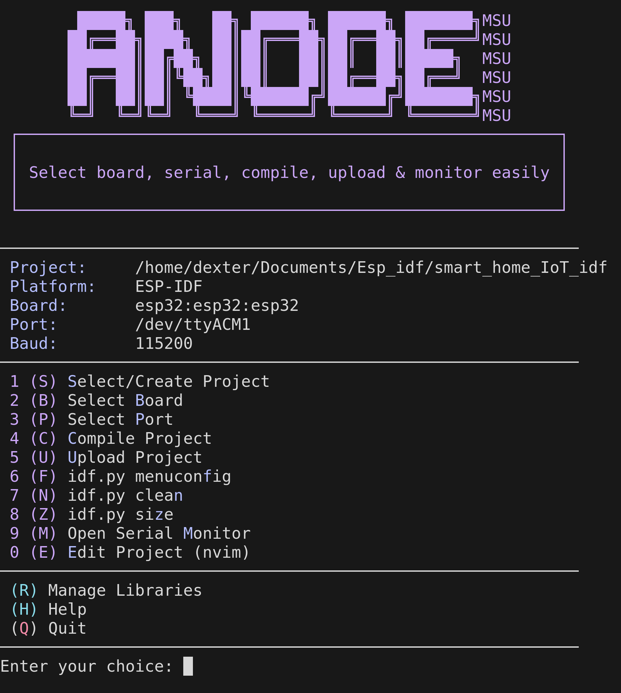

# Anode MCU Manager

<p align="center">
  
</p>

<p align="center">
  <a href="https://aur.archlinux.org/packages/anodemcu-git"></a>
  
  
  
  
</p>

<p align="center">
  
  
  
</p>

---

<p align="center">
  
  &nbsp;&nbsp;&nbsp;
  
  &nbsp;&nbsp;&nbsp;
  
</p>

`anodemcu` is a **premium, interactive TUI (Terminal User Interface)** designed to simplify microcontroller development. It transforms the command-line tools into a vibrant, intuitive experience, allowing you to manage boards, ports, libraries, and projects across multiple ecosystems.

> [!TIP]
> **Perfect for developers** who live in the terminal and want a high-speed, "no-nonsense" workflow for compiling and uploading code.

## Features

- **Multi-Platform Support**: Seamlessly work with **Arduino CLI**, **ESP-IDF**, and **PlatformIO** projects.
- **Auto-Detection & Ambiguity Resolution**: Automatically detects the project type based on files. If multiple configurations exist (e.g. both `CMakeLists.txt` and `platformio.ini`), it prompts you to select your preferred platform and saves the choice.
- **ESP-IDF Auto-Sourcing**: Automatically locates and sources the ESP-IDF `export.sh` script if it's not active in the current shell environment.
- **Rich Terminal UI**: Vibrant color-coded interface with a live dashboard header.
- **Fuzzy Search Integration**: Powered by `fzf` for near-instant selection of boards, ports, and libraries.
- **Smart Project Management**: Create, select, and edit projects (Neovim support) from a single menu, starting automatically in the current directory if it is a valid project.
- **Safe Uploads**: Automatic project backups before every upload (keeps the last 5 versions).
- **Integrated Monitor**: Quick access to the serial monitor for real-time debugging.
- **Operation Logging**: Complete history of your actions with automatic log rotation.
- **Native Arch Linux Support**: Available directly via the AUR.

---

## Installation

### Arch Linux (AUR)
If you are on Arch, this is the recommended way:
```bash
yay -S anodemcu
```

### Global Installation (Any Linux/macOS)
Clone the repository and run the automated installer:
```bash
git clone https://github.com/abod8639/anodemcu.git
cd anodemcu
./install.sh
```
*This will install the tool to `~/.local/bin/anodemcu` and set up a convenient `anode` alias.*

### Manual Install
```bash
chmod +x anodemcu
# Run locally
./anodemcu
```

---

## Prerequisites

| Dependency | Purpose | Status |
| :--- | :--- | :--- |
| `bash` | Script execution | **Required** |
| `arduino-cli` | Arduino compilation and upload | Required for Arduino projects |
| `idf.py` (ESP-IDF) | ESP-IDF compilation and upload | Required for ESP-IDF projects |
| `pio` (PlatformIO) | PlatformIO compilation and upload | Required for PlatformIO projects |
| `fzf` | Interactive fuzzy searching | Recommended |
| `jq` | Update notifications | Recommended |
| `nvim` | Integrated code editing | Optional |

<!-- install Prerequisites command  -->

### Arch Linux
```bash
yay -S arduino-cli fzf jq neovim
```

### Debian/Ubuntu
```bash
sudo apt update
sudo apt install arduino-cli fzf jq neovim
```

### Fedora
```bash
sudo dnf install arduino-cli fzf jq neovim
```

---

## How to Use

Simply type `anode` (if installed globally) or `./anodemcu` to open the main menu.

### Keyboard Shortcuts & Platform-Specific Actions
Use these single-key triggers for a lightning-fast workflow:

| Key | Action | Platform / Ecosystem |
| :---: | :--- | :--- |
| **S** | Select/Create Project | All |
| **B** | Select Board (FQBN / Target) | All (IDF: `set-target`, PIO: updates `platformio.ini`) |
| **P** | Select Port | All |
| **C** | Compile Project | All (`arduino-cli`, `idf.py build`, or `pio run`) |
| **U** | Upload Project | All (`arduino-cli`, `idf.py flash`, or `pio run -t upload`) |
| **M** | Open Serial Monitor | All |
| **E** | Edit Code (Neovim) | All |
| **R** | Manage Libraries | Arduino |
| **L** | List Cores | Arduino |
| **A** | List All Supported Boards | Arduino |
| **I** | Install Core | Arduino |
| **F** | Open configuration menu (`idf.py menuconfig`) | ESP-IDF |
| **N** | Clean build files (`idf.py clean` or `pio clean`) | ESP-IDF / PlatformIO |
| **Z** | Show flash size statistics (`idf.py size`) | ESP-IDF |
| **O** | Install PlatformIO library (`pio pkg install`) | PlatformIO |
| **H** | Show Help | All |

---

## Configuration

The tool maintains its state automatically, but you can customize defaults by editing your local configuration or the script header:
```bash
DEFAULT_FQBN="esp32:esp32:esp32"
DEFAULT_PORT="/dev/ttyACM1"
SKETCH_DIR="$HOME/Arduino"
```

## Troubleshooting

- **Upload Failed?** Check your USB cable and ensure the port (`P`) is correctly selected.
- **Library Missing?** Use the Library Manager (`R`) to search and install missing dependencies.
- **Permission Denied?** Ensure your user is in the `uucp` or `dialout` group (on Linux).

---

## 📜 License & Acknowledgments

Distributed under the **MIT License**. See `LICENSE` for more information.

Built with ❤️ by [Dexter](https://github.com/abod8639)


